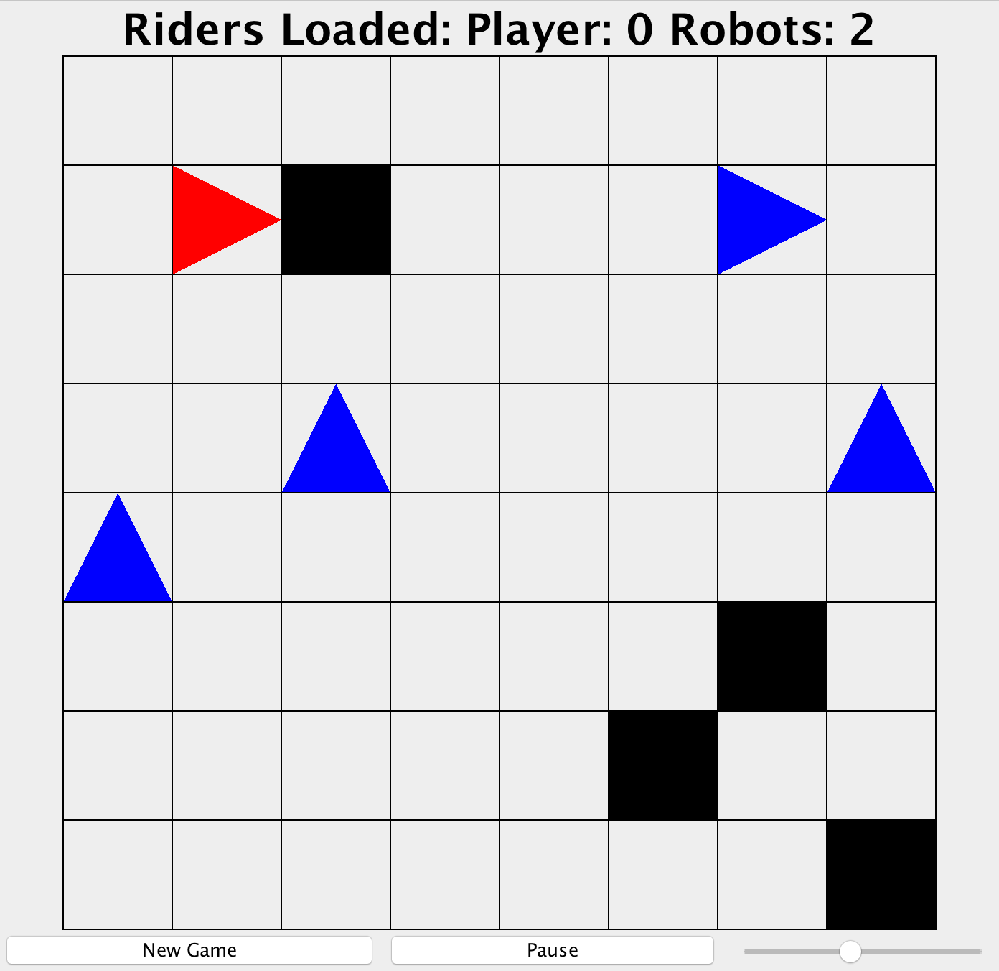

# Taxi-Game
### Overview

A very simple game simulating drivers picking up passengers using a grid.
### Gameplay
The game has the following elements
- robocars (blue triangle)
- obstacles (black square)
- passengers (yellow square)
- player (red triangle) 

Once in a while a pssenger will show up on the grid, and there will only be 1 passenger at a time. Pick up the passenger by moving to the same cell, and the goal is to pick up as many passengers as you can. As game progresses number of competitors and obstacles increase, and the pace of the game get faster.
### Controls
- h - left turn
- l - right turn
- New Game - Start a new game
- Pause/Continue - Pause / Continue the current game
- Slide Bar - adjust game speed
### Starting Game
Games can be started by providing a configuration file. Under bin/ execute 
> java Simulation configFileName

Configuration files generally looks like
> player r c 
> robocar r c [east | north | random] 
> obstacle r c 
> rider r c 

"r" and "c" stand for row and column number of a game element. No two elements should be placed on the same cell in a configuration file. For robocar, the additional parameter descibes the behavior when a rider is not present. For instance, "east" means robocar roams left and right. 
 
Alternatively you can omit configuration file and use default setup (starting with just the player)
> java Simulation rows columns

where rows and columns are integers describing the size of the grid.
